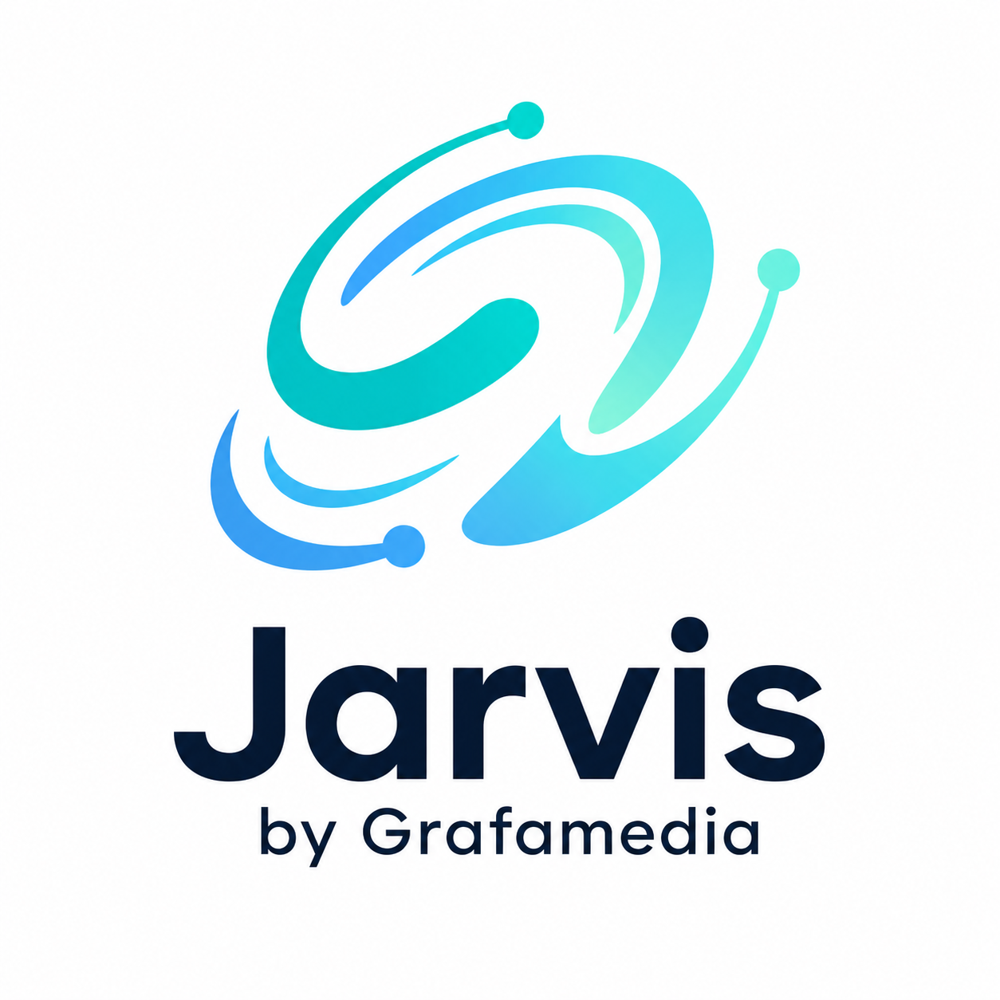

<p align="center">
  
</p>

<h1 align="center">Jarvis Remote</h1>

<p align="center">
  <b>Kontrol Claude Code & Codex di PC/laptop kamu — dari HP, dari mana saja.</b><br>
  Dibuat oleh <a href="#tentang">Grafamedia</a> 🇮🇩
</p>

---

**Jarvis Remote** adalah aplikasi self-hosted untuk "ngoding jarak jauh" bersama AI.
Satu agent kecil berjalan di tiap mesin kerja (PC Ubuntu, laptop Windows), lalu dari
browser HP kamu bisa: pindah-pindah mesin, membuka project apa pun, memulai sesi
**Claude Code** atau **Codex**, mengirim prompt (teks, suara, atau gambar), dan —
yang paling penting — **menjawab konfirmasi izin AI (yes/no) langsung dari notifikasi
HP atau Telegram**, walau aplikasinya sedang tidak dibuka.

## ✨ Fitur

| | |
|---|---|
| 💬 **Mode Chat** | Claude Code via Agent SDK: bubble percakapan, kartu tool, kartu izin dengan **preview diff merah/hijau** sebelum approve |
| ⌨️ **Mode Terminal** | Terminal penuh (xterm.js) di HP — jalankan Claude CLI, Codex, atau shell interaktif dengan tombol panah/Esc/Ctrl+C |
| 🔔 **Notifikasi dual-channel** | Web Push (tombol Izinkan/Tolak langsung di notifikasi) **dan** Telegram bot (inline button) — dua-duanya dikirim paralel |
| 🖥️ **Multi-mesin** | Daftarkan semua mesin (Windows/Linux), pindah dari satu dropdown |
| 🔁 **Riwayat & resume** | Sesi chat tersimpan di SQLite; tutup kapan saja, lanjutkan lagi dengan konteks utuh |
| 🛡️ **Auto-izin ber-scope** | Per sesi: `baca` / `edit file` / `bash` / `semua` — sisanya selalu minta konfirmasi |
| 🖼️ **Kirim gambar** | Lampirkan screenshot/foto dari galeri atau kamera; AI melihatnya langsung |
| 🎙️ **Prompt suara** | Transkripsi lokal via Whisper (opsional, bahasa Indonesia) |
| 🌿 **Git panel** | Status, diff, log, pull, push, commit dari HP tanpa lewat AI |
| 📱 **PWA** | Install ke home screen, tampil seperti aplikasi native |
| 🔐 **Aman** | Bearer token di semua endpoint, akses via jaringan privat Tailscale (tanpa port publik) |

## 🏗️ Arsitektur

```
                    Tailscale mesh (WireGuard, privat)
   HP (PWA) ───────────────┬──────────────────────┬─────────────
                           │                      │
                 Jarvis Agent @ Laptop     Jarvis Agent @ PC
                 (Windows 10)              (Ubuntu)
                 FastAPI + PTY/SDK         FastAPI + PTY/SDK
                     │                         │
                 Claude Code / Codex       Claude Code / Codex
```

- Tiap mesin menjalankan **agent** yang sama (folder ini). Tidak ada server pusat.
- HP terhubung langsung ke agent lewat IP/hostname Tailscale — aman dari jaringan
  seluler mana pun tanpa membuka port ke internet.
- Sesi AI hidup di mesin, bukan di HP: HP boleh mati/putus, kerjaan jalan terus.

## 📋 Prasyarat

Di **setiap mesin** yang mau dikontrol:

1. **Python 3.10+**
2. **Node.js + npm** (untuk CLI AI)
3. **Claude Code** (`npm i -g @anthropic-ai/claude-code`, lalu `claude` → login) dan/atau
   **Codex** (`npm i -g @openai/codex`, lalu `codex login`)
4. **Tailscale** — install juga di HP, login akun yang sama:
   ```bash
   curl -fsSL https://tailscale.com/install.sh | sh
   sudo tailscale up
   ```
5. (Opsional) **Bot Telegram** — buat via [@BotFather](https://t.me/BotFather).
   ⚠️ **Satu bot hanya untuk satu mesin** (long-polling konflik jika dipakai dua agent).
   `chat_id` kamu bisa dilihat dari `https://api.telegram.org/bot<TOKEN>/getUpdates`
   setelah mengirim pesan apa pun ke bot.

## 🚀 Instalasi

### Linux (Ubuntu/Debian)

```bash
git clone <repo-ini> jarvis && cd jarvis
./setup.sh                        # buat venv + install dependensi
nano backend/.env                 # isi konfigurasi (lihat bawah)
./start.sh                        # agent jalan di port 8300
```

### Windows 10/11

```bat
git clone <repo-ini> jarvis && cd jarvis
setup.bat                         :: install dependensi + cek Codex
copy backend\.env.example backend\.env
notepad backend\.env              :: isi konfigurasi
start.bat                         :: agent jalan di port 8300
```

### Konfigurasi `backend/.env`

```ini
# WAJIB — token rahasia untuk login dari HP (bebas, string acak panjang)
# generate: python -c "import secrets; print(secrets.token_hex(24))"
JARVIS_AUTH_TOKEN=isi-token-rahasia-kamu

# Nama mesin yang tampil di app & prefix notifikasi
JARVIS_MACHINE_NAME=PC-Ubuntu

# Telegram (opsional — kosongkan untuk menonaktifkan; 1 bot per mesin!)
TELEGRAM_BOT_TOKEN=
TELEGRAM_CHAT_ID=

# Root folder project, pisahkan dengan ; jika lebih dari satu
# Linux:   PROJECT_ROOTS=/home/user/_2026
# Windows: PROJECT_ROOTS=C:\xampp\htdocs;D:\_2026
PROJECT_ROOTS=

# Voice input Whisper (opsional, butuh package faster-whisper)
WHISPER_ENABLED=false
WHISPER_MODEL_SIZE=small
```

### Aktifkan HTTPS (untuk notifikasi Web Push & PWA penuh)

Web Push dan instalasi PWA penuh mensyaratkan HTTPS. Tailscale menyediakannya gratis:

```bash
sudo tailscale set --operator=$USER      # sekali saja
tailscale serve --bg http://localhost:8300
```

App kamu kini punya alamat `https://<nama-mesin>.<tailnet>.ts.net`.
(Jika diminta, aktifkan **MagicDNS** dan **HTTPS Certificates** di
[admin console Tailscale](https://login.tailscale.com/admin/dns).)

## 📱 Cara Pakai

### Setup pertama di HP

1. Pastikan **Tailscale di HP aktif**, lalu buka alamat agent di Chrome —
   `https://<mesin>.<tailnet>.ts.net` (atau `http://<ip-tailscale>:8300`).
2. Form **Mesin** muncul otomatis: isi nama, URL, dan `JARVIS_AUTH_TOKEN` → Simpan.
3. Tap **🔔 Aktifkan notifikasi HP** (butuh HTTPS) → izinkan → notifikasi tes masuk.
4. Menu Chrome → **Add to Home Screen** untuk install sebagai aplikasi.
5. Punya mesin lain? Ulangi instalasi agent di mesin itu, lalu tambahkan lewat
   menu mesin (tap nama mesin di kiri atas).

### Ngoding dengan AI

1. Tap **☰** (kanan atas) → pilih mode:
   - **Chat** — Claude Code terstruktur *(direkomendasikan)*
   - **Claude CLI / Codex / Shell** — terminal interaktif penuh
2. Tap project → sesi dimulai.
3. Ketik prompt, atau tap **🎙** untuk bicara, atau **📎** untuk melampirkan
   gambar (screenshot desain, foto error, dsb. — AI benar-benar melihatnya).
4. Saat AI butuh izin (jalankan command / edit file), muncul **kartu izin**
   dengan preview-nya. Jawab lewat salah satu dari tiga tempat — semuanya setara:
   - tombol di **app**,
   - tombol di **notifikasi HP**,
   - tombol di **Telegram**.
5. Atur **auto-izin** per sesi dari bar di atas kolom ketik
   (`baca` menyala default; `edit file`, `bash`, `semua` opsional).
6. Kelola sesi dari dropdown tengah topbar: beberapa project bisa jalan paralel.
7. Sesi chat yang ditutup bisa dilanjutkan dari **Riwayat Chat** (drawer ☰) —
   konteks percakapan tetap nyambung.

### Perintah Telegram

- Tombol pada pesan notifikasi → jawab izin / kirim keystroke ke terminal.
- **Reply** pesan notifikasi → teksnya diketik ke sesi tersebut.
- `/status` → daftar sesi yang sedang berjalan di mesin itu.

## 🩺 Troubleshooting

| Gejala | Solusi |
|---|---|
| Mesin "tidak terjangkau" di HP | Cek Tailscale aktif di HP & mesin (`tailscale status`); cek agent jalan (`./start.sh`) |
| Tombol Codex/Chat redup | CLI-nya belum terinstall di mesin itu — lihat Prasyarat; app mengecek ulang otomatis |
| Notifikasi HP tidak muncul | Harus diakses via HTTPS (`tailscale serve`); cek izin notifikasi browser; Telegram tetap jalan sebagai cadangan |
| Telegram error 409 di log | Satu bot dipakai dua mesin — buat bot baru untuk mesin kedua |
| Ikon PWA tidak berubah setelah update | Uninstall PWA → buka di Chrome → refresh 2× → install ulang |
| Port 8300 bentrok | `JARVIS_PORT=8400 ./start.sh` (atau set env yang sama di Windows) |
| Voice gagal | Set `WHISPER_ENABLED=true` + `pip install faster-whisper` di venv backend |

## 🔐 Catatan Keamanan

- Agent ini bisa mengeksekusi perintah di mesinmu — **jangan pernah** mengeksposnya
  ke internet publik. Gunakan hanya di dalam tailnet.
- Semua endpoint (kecuali halaman HTML) wajib Bearer token; WebSocket divalidasi token;
  tombol notifikasi divalidasi nonce HMAC per-request.
- File rahasia (`backend/.env`, `vapid_private.pem`, `jarvis.db`) sudah masuk `.gitignore`.

## 🗂️ Struktur Project

```
jarvis/
├── backend/
│   ├── main.py                  # FastAPI: API, WebSocket, auth, upload, git
│   ├── config.py                # konfigurasi dari .env (cross-platform)
│   └── services/
│       ├── session_manager.py   # sesi PTY interaktif (claude/codex/shell)
│       ├── chat_service.py      # sesi chat Claude Agent SDK + permission
│       ├── telegram_service.py  # notifikasi + approve via Telegram
│       ├── push_service.py      # notifikasi Web Push (VAPID)
│       ├── whisper_service.py   # transkripsi suara lokal
│       ├── project_service.py   # scan & kelola folder project
│       └── db.py                # SQLite: riwayat chat, subscription push
├── frontend/index.html          # PWA satu-file: chat, terminal, drawer
├── setup.sh / start.sh          # Linux
├── setup.bat / start.bat        # Windows
└── PRD.md                       # dokumen desain & riwayat pengembangan
```

## <a name="tentang"></a>🏢 Tentang

**Jarvis Remote** dikembangkan oleh **Grafamedia** sebagai tools internal untuk
mengendalikan AI coding assistant (Claude Code & Codex) dari perangkat mobile.

© Grafamedia. Dibangun dengan FastAPI, xterm.js, Claude Agent SDK, dan Tailscale.
